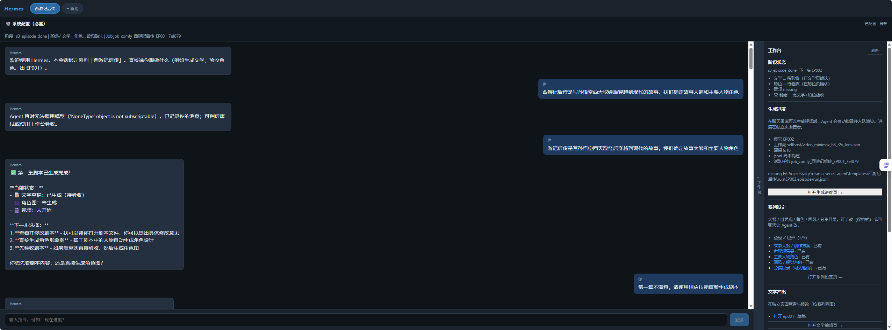

# Drama Series Agent

[](LICENSE)
[](https://www.python.org/)
[](https://github.com/comfyanonymous/ComfyUI)

**English** · [中文](README.zh-CN.md)

> From a one-line idea to a chained vertical short-drama episode —  
> **develop → write → cast → Ref2VA render** — in one series-scoped agent.

https://github.com/user-attachments/assets/52c170e2-bc91-41d2-8b3d-3f2de95c023c

In one series chat you can walk through **series settings → episode script → cast portraits → video render**, all under the same `series_id`, then continue into the next episode.

---

## Why this project?

| Pain | What we ship |
|------|----------------|
| Ideas die in notes | [`skills/`](skills/) for develop, write, and H3 wiring |
| Scripts that cannot be shot | Auto-built shot tables for ComfyUI (with cast / voice refs) |
| One-off clips, no shot continuity | **Prev-shot tail → next first frame** — auto chain, **no manual editing** |
| Too many separate tools | One web workbench (+ optional CLI): chat and render progress together |

---

## Features

- **What Hermes does (vs ComfyUI)**  
  ComfyUI + MiniMax H3 turn **one shot** into video. Hermes covers the path **from a sentence to something you can render, resume, and revise**:

  1. You say “develop / write EP1” → Hermes writes **series settings** (plan, world, characters, art style, episode map) and the episode script  
  2. Cast portraits are ready → Hermes binds “who appears in which shot” into the shot task table  
  3. You say “render EP1” → it builds render files and queues your local ComfyUI  
  4. If it stops → resume that episode from the breakpoint on the Jobs page; dislike one shot → re-render only that shot and re-concat  
  5. If you change settings or rewrite a script → only the steps that must re-run are marked dirty, not a blind full-episode redo by default  

  In short: you should not hand-copy files or manually sync status between chat and ComfyUI.

- **Layered memory (what each layer keeps)**
  - **Chat log** `memory/chat.jsonl` — what you asked the agent to do
  - **Project summary** `memory/PROJECT.md` — series-level facts so later turns still “know which show this is”
  - **Series settings** `dramas/{series}/` — plan, world, characters, art style, episode map (used when writing scripts)
  - **Progress state** `series_runtime.json` — how far each episode is (script / cast / render), resume shot, chosen workflow
  - **Action trace** `memory/traces.jsonl` — which tools ran (e.g. catch “rewrite script” wrongly starting a render)  
  Changing settings or regenerating a script only invalidates the downstream steps that need redo.

- **Where LLMs come from** — presets: **ModelScope (friendly free tier)**, Qwen (DashScope), OpenAI, Claude, DeepSeek, Moonshot, local Ollama; any OpenAI-compatible API works
- **Skill packs** — develop / write / H3 prompt skills under [`skills/`](skills/), editor-agnostic
- **Local render** — MiniMax H3 workflows in [`workflows/selfhost/`](workflows/selfhost/); you bring ComfyUI + models
- **Cast library** — `data/cast/{series}/` portraits, optional voice refs
- **Web UI / CLI** — chat and jobs in the browser; or `drama-series-render` for a headless episode

<p align="center">
  
</p>
<p align="center"><em>Workbench: chat on the left, per-episode progress and render jobs on the right</em></p>

---

## Quick start

### Requirements

- Python **3.10+**
- **ffmpeg** (see [Install ffmpeg](#install-ffmpeg) below)
- Optional: Node **18+** for the React workbench
- Optional: OpenAI-compatible LLM for the agent chat (e.g. ModelScope)

### ComfyUI (required for video render — install yourself)

This repo does **not** bundle ComfyUI or MiniMax H3 weights. You must:

1. **Install [ComfyUI](https://github.com/comfyanonymous/ComfyUI) yourself** and keep it running (default `http://127.0.0.1:8188`).
2. Install the **MiniMax H3 Ref2VA custom nodes** your graphs need (e.g. `MiniMaxH3ReferenceToVideo` and related loaders / optional SageAttention · BlockCache nodes used by the `*_fast` / `*_turbo` tiers).
3. **Download every model file referenced by the workflow JSON** into the matching ComfyUI folders (`models/diffusion_models`, `models/text_encoders`, `models/vae`, `models/loras`, … — follow ComfyUI’s usual layout). Typical names from [`workflows/selfhost/`](workflows/selfhost/):

| File (examples) | Used by |
|-----------------|---------|
| `minimax_h3_ref2va_pruned_int8_convrot.safetensors` | UNET / Ref2VA (fast · lora · turbo) |
| `minimax_h3_fl2va_pruned_int8_convrot.safetensors` | Quality tier `video_minimax_h3_r2v.json` |
| `qwen3vl_32b_minimax_h3_nvfp4_awq.safetensors` | Text encoder / CLIP |
| `minimax_h3_video_vae_fp16.safetensors` | Video VAE |
| `minimax_h3_audio_vae_fp32.safetensors` | Audio VAE |
| `minimax_h3_ref2v_turbo_4step_v0.1_comfyui_bf16.safetensors` | Lightning LoRA (`*_lora` / `*_turbo`) |

4. Open the chosen workflow once in the ComfyUI UI and confirm **no red/missing nodes or models**, then point this agent at the same server (`COMFYUI_URL` / system config).

Without a ready ComfyUI + models, you can still develop settings, write scripts, and manage cast in the workbench — **video jobs will fail** until the above is done.

### Install ffmpeg

ffmpeg is required after each shot to extract the **tail frame** (chain continuity) and to concat shots into `master.mp4`.  
Resolution order in code: `FFMPEG_PATH` → `PATH` → bundled **`imageio-ffmpeg`** (pulled in by `pip install`).

**Recommended: install a system binary** (clearer for debugging):

<details>
<summary><strong>Windows</strong></summary>

```powershell
# Option A — winget
winget install --id Gyan.FFmpeg -e

# Option B — scoop
scoop install ffmpeg

# Option C — chocolatey
choco install ffmpeg
```

Or download a build from [gyan.dev ffmpeg builds](https://www.gyan.dev/ffmpeg/builds/) / [BtbN](https://github.com/BtbN/FFmpeg-Builds/releases), unzip, and either:

1. Add `...\ffmpeg\bin` to **User PATH**, or  
2. Set in `.env`:

```env
FFMPEG_PATH=C:\ffmpeg\bin\ffmpeg.exe
```

Verify in a **new** terminal:

```powershell
ffmpeg -version
```

</details>

<details>
<summary><strong>macOS</strong></summary>

```bash
brew install ffmpeg
ffmpeg -version
```

</details>

<details>
<summary><strong>Linux (Debian/Ubuntu)</strong></summary>

```bash
sudo apt update
sudo apt install -y ffmpeg
ffmpeg -version
```

</details>

**Fallback (no system ffmpeg):** `pip install -e .` already depends on `imageio-ffmpeg`, which downloads a static binary into the venv. That is enough for Quick Start; set `FFMPEG_PATH` only if you want to force a specific build.

### Install the project

```bash
git clone https://github.com/binwu1/drama-series-agent.git
cd drama-series-agent

python -m venv .venv
# Windows:
.venv\Scripts\activate
# macOS/Linux:
source .venv/bin/activate

python -m pip install -U pip
pip install -e ".[render,dev]"
copy .env.example .env          # Windows
# cp .env.example .env          # macOS/Linux
# edit .env → COMFYUI_URL / LLM_* / optional FFMPEG_PATH
```

### Verify install

```bash
python scripts/doctor.py
```

You should see `[OK]` for ffmpeg, skills, comfykit, API router, and CLI entry points.  
If ffmpeg fails: install a system binary (above) or confirm `imageio-ffmpeg` is in the active venv.

### Launch API (+ web workbench)

```bash
# Windows — API + Vite UI
.\start.ps1 -WithWeb

# macOS / Linux
./start.sh --with-web
```

| Surface | URL | Notes |
|---------|-----|--------|
| **Web workbench** | **http://localhost:5173/** | Default Vite port (`web/`). Chat, series settings, scripts, cast, jobs, system config. |
| API (OpenAPI) | http://127.0.0.1:8000/docs | Backend the UI calls |
| API base used by UI | `http://127.0.0.1:8000/api/series` | Override with `web/.env`: `VITE_HERMES_API_BASE=...` |

Open **http://localhost:5173/** after both processes are up. If the page loads but chat/settings fail, the API is not running on port **8000** (start it first, or point `VITE_HERMES_API_BASE` at your API).

Without the helper scripts:

```bash
# terminal 1 — API
python scripts/run_api.py --host 127.0.0.1 --port 8000

# terminal 2 — workbench (http://localhost:5173/)
cd web
npm install
npm run dev
```

### Render one episode (CLI)

1. Cast: `data/cast/{series}/{character}.png` (+ optional `voices/{character}.wav`)
2. Run files: `templates/{series}/run/EP001.episode-run.jsonl` + `EP001.episode-meta.json`
3. ComfyUI at `COMFYUI_URL` (default `http://127.0.0.1:8188`)

```bash
drama-series-render \
  --project templates/<series> \
  --episode EP001 \
  --cast-series <series> \
  --context-ir off \
  --comfyui-url http://127.0.0.1:8188
```

Output: `templates/{series}/output/{EP}/master.mp4` (shots concat with a short head trim).

---

## Workflows

API graphs live under [`workflows/selfhost/`](workflows/selfhost/). Import / align them in **your** ComfyUI, and download any model the JSON names (see [ComfyUI requirements](#comfyui-required-for-video-render--install-yourself)).

| Workflow | Role |
|----------|------|
| `selfhost/video_minimax_h3_r2v_fast.json` | Default speed tier (20 step + accel nodes) |
| `selfhost/video_minimax_h3_r2v_lora.json` | Lightning LoRA 4-step path |
| `selfhost/video_minimax_h3_r2v_turbo.json` | Turbo / experimental speed |
| `selfhost/video_minimax_h3_r2v.json` | Quality / fl2va tier |

Pick the video workflow in the system config panel or `config.json` → `comfyui.video.default_workflow`.

---

## Repository layout

```text
skills/                         # canonical agent skills (open-source layout)
src/drama_series_agent/
  agent/  drama/  intake/  api/ # orchestration
  adapters/r2v/                 # H3 episode runner
workflows/selfhost/             # ComfyUI API graphs
data/cast/{series}/             # character anchors + voices/
projects/{series}/              # series_runtime, memory, jobs
templates/{series}/             # run/ + output/
web/                            # React workbench
docs/                           # architecture, contracts, assets
```

Cursor users who want project-skill auto-discovery can run `scripts/link_cursor_skills.ps1` / `.sh` (links are gitignored). Edit skills only under `skills/`.

---

## Documentation

- [**User Guide**](docs/USER_GUIDE.md) · [用户手册](docs/USER_GUIDE.zh-CN.md)
- [Development home](docs/DEVELOPMENT.md)
- [Architecture & contracts](docs/README.md)
- [Skills index](skills/README.md)
- [Promo assets](docs/assets/README.md)

---

## Contributing

Issues and PRs are welcome. Keep changes focused; prefer small PRs with a clear why.

1. Fork & branch from `main`
2. `pip install -e ".[render,dev]"`
3. Open a PR with a short summary and test notes

---

## License

[Apache License 2.0](LICENSE)

Literary skill content under `skills/0xsline-short-drama/` retains its upstream license notice where present.
