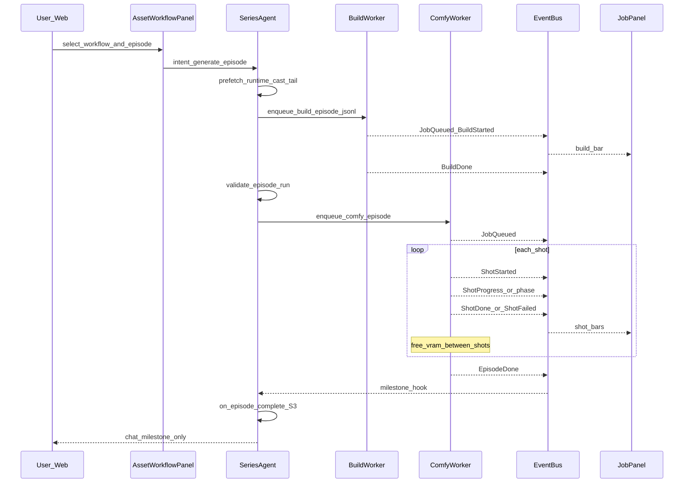

# S2 → S3 sequence (async render + next episode)

## S2 sequence

## Agent tools (S2)

1. `select_workflow(project_dir, workflow, aspect?, context_ir?)` — persist series default
2. `enqueue_build_episode_jsonl(project_dir, episode_id, force?)` → `job_id`  
   - **v1 scaffold**: literary dialogues + cast → valid Ref2VA-ish `run/{EP}.episode-run.jsonl` + meta  
   - skips if jsonl exists unless `force`
3. `validate_episode_run(project_dir, episode_id)` — wraps `h3_r2v_episode.validate`
4. `enqueue_comfy_episode(...)` → `job_id`
5. `run_s2_build_and_comfy(...)` — one-shot build→validate→Comfy (`skip_comfy` for dry-run)
6. `get_job_status` / `resume_from_shot` / `list_active_jobs`

Web: `web/components/hermes_s2_panel.py` (workflow picker + Build / Validate / Comfy / one-shot).

Chat must not block on Comfy sampling. Polling/SSE is Job Panel + optional Agent prefetch on next user turn.

## S3 on EpisodeDone

`on_episode_complete(project_dir, episode_id, …)`:

1. Soft-check `master.mp4` (`master_exists` flag; missing file alone does not force `failed`)
2. Patch `series_runtime.json`:
   - `last_completed_episode` / `next_episode` / `stage=s3_episode_done`
   - `episodes.{EP}.status` / `master_path` / `tail_frame`
3. Ensure `templates/.../continuity/episode-tails.json` (discover last `tail_frame.png` if runner already wrote shots)
4. Append L1 `memory/PROJECT.md` fact line
5. Emit Milestone + EpisodeDone on EventBus
6. Optional: `propose_voice_harvest` (list only — never auto hard-lock)

## Next episode utterance

User: 「生成七龙珠第二集」 / Web Continue / tool `continue_series`:

1. `prefetch_next_episode` — resolve EP, literary/cast/tail/workflow gaps
2. If literary missing → `ensure_literary_for_episode` → **block** until S1 Accept
3. Else → `run_s2_build_and_comfy` (reuse default workflow)
4. Job Panel shows progress; same conversation / `series_id`

Tools: `prefetch_next_episode`, `ensure_literary_for_episode`, `continue_series`, `get_series_progress`, `propose_voice_harvest`.

Web: `web/components/hermes_s3_panel.py` (tab **S3 Continue**).

## Failure / resume

- `ShotFailed` → episode job `failed` or `partial`; runtime stores `resume_from_shot`
- User 「从 SHOT-005 续跑」→ `resume_from_shot` on same job kind `comfy_episode`
